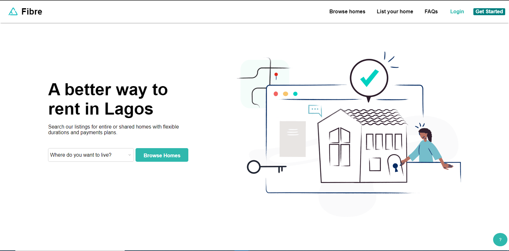
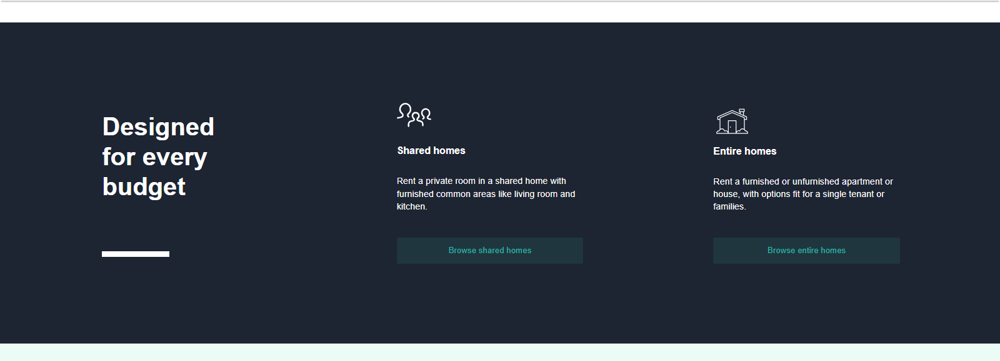

# Fibre Clone

### This is a _[fibre.ng](https://fibre.ng)_ cloned website showing `A better way to rent in Lagos`. It's not a full clone of the original website because of copyright reasons but contains important features.

## Replicated Features

<h3>
  <li>Responsive design</li>
  <li>Layout of the original website</li>
  <li>Absence of scroll bar at the side of the website</li>
  <li>Custom Dropdown menu with just css on the first section</li>
</h3>

## Languages Used

### HTML5

### CSS3

## Why I used them

### I used the languages above to perfect my **CSS** skill, mainly _responsive design_ and _cloning a website to look close to it_

## Issues I'm aware of and hope to fix

<h3>
  <li>The responsive design is not perfect</li>
  <li>The whole website breaks at around 264px</li>
</h3>

## How to install and run the project

### Fork the project and clone it to your local machine

```bash
git clone <repo>
```

### Redirect to the _index.html_ file on your browser or use live server to start the project

## Demo





### **[Live Demo](https://bemdoom-fibre-clone.vercel.app)**

## 👨‍💻Author

### **[Bemdoo Maor](https://github.com/MaorBemdoo)**

## License

### This repository is **[MIT](LICENSE)** licensed.
